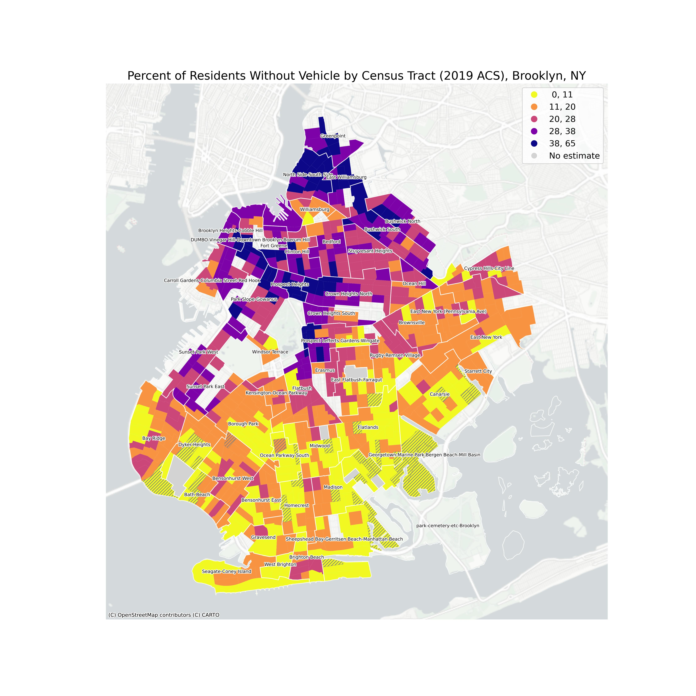

# Brooklyn is a borough of pedestrians.
Especially in the densest parts close to Manhattan.

# However, pedestrian accidents are common. And most collisions occur at intersections. 

(collisions_intersections.png)

# Some intersections are more dangerous than others.

(just_intersections.png)

# Explore Brooklyn's pedestrian safety problem further in this interactive map.

Red circles represent Brooklyn's most dangerous intersections (those intersections in the borough's 99th percentile of number of number of pedestrian incidents.)

Black dots represent pedestrian fatalities.

<iframe src="bk_accidents.html" width = "500" height = "500"></iframe>

